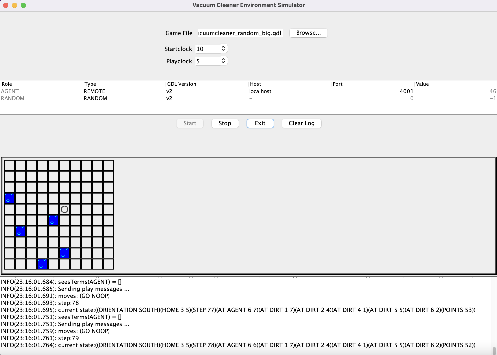

# Cleaning Agent Project

## Introduction

This is the solution to a cleaning problem where the goal was to implement
an agent to manage to start in a random position, clean all dirty cells
and find its way back home. The agent has two sensors: 1. bumping sensor 2. Dirt sensor.
The task is to implement the logic to solve this problem by only being able to read in the
result from those two sensors.

## Image

### Simulator
Blue boxes represent dirt and the circle represents the cleaning agent

## Downloading and starting simulation

### Requirements

To start this project you will require two things:

1. Install python 3.8 or greater
2. Download the JDK for your OS though this link: https://www.oracle.com/java/technologies/downloads/

In some cases you are required to install Xcode, then you should be able to just run "xcode-select --install"

### Start simulation

1. Open the simulator vacuumcleanersim.jar
2. Press "Browse..." and select one of the tree simulator environment in this folder(vacuumcleaner.gdl, vacuumcleaner_random.gdl or vacuumcleaner_random_big.gdl)
3. Run gameplayer.py (you should see "MyAgent is listening on port 4001 ...")
4. Then press the "start" button and the simulator will start running the simulation(if you want to run a new simulation please rerun gameplayer.py as well)
